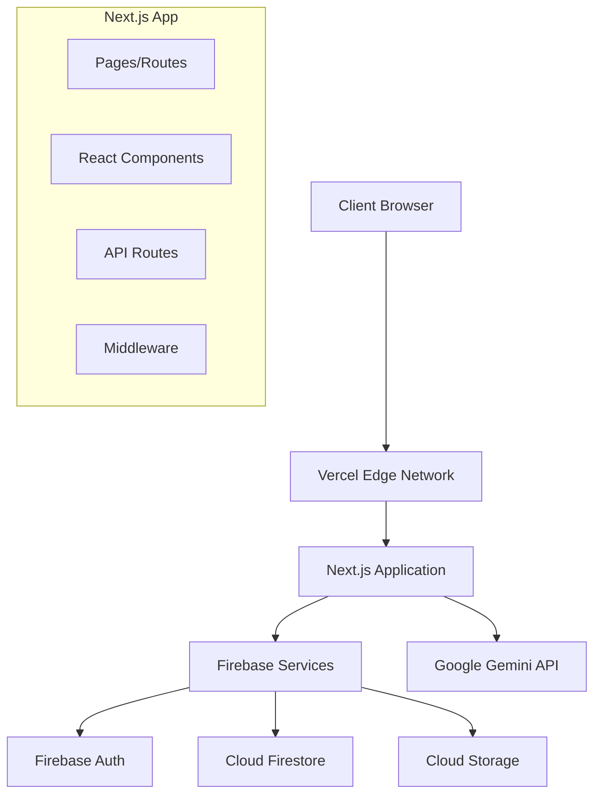

# Documentation Requirements: Ingredients for Ownership

## Overview
This document defines comprehensive documentation standards for the health coaching web application, ensuring maintainability, user adoption, and seamless handoffs throughout the development lifecycle.

## Documentation Philosophy

### Core Principles
1. **User-Centric**: Documentation serves both developers and end-users (coaches/clients)
2. **Living Documents**: Keep documentation current with code changes
3. **Progressive Disclosure**: Start simple, add detail as needed
4. **Visual Communication**: Use diagrams, screenshots, and examples
5. **Accessibility**: Ensure documentation is accessible to all skill levels

## Required Documentation Structure

### Project Root Documentation
```
├── README.md                     # Project overview and quick start
├── CONTRIBUTING.md               # Development guidelines
├── DEPLOYMENT.md                 # Deployment instructions
├── CHANGELOG.md                  # Version history and changes
└── docs/                         # Detailed documentation
    ├── api/                      # API documentation
    ├── components/               # Component documentation
    ├── user-guides/              # End-user documentation
    ├── architecture/             # Technical architecture
    └── deployment/               # Deployment guides
```

## README.md Template

```markdown
# Ingredients for Ownership

A modern web application that helps health coaches create personalized nutritional plans for their clients, replacing inefficient PDF-based workflows with AI-assisted plan generation.

## 🎯 Project Overview

**Mission**: Replace manual PDF workflows with dynamic, AI-assisted nutritional plan creation
**Users**: Health coaches and their clients
**Tech Stack**: Next.js, React, Tailwind CSS, Firestore, Firebase Auth, Google Gemini AI

## 🚀 Quick Start

### Prerequisites
- Node.js 18+ 
- npm or yarn
- Firebase project with Firestore enabled
- Google Gemini API key (optional for AI features)

### Installation
```bash
# Clone the repository
git clone [repository-url]
cd ingredients-for-ownership

# Install dependencies
npm install

# Set up environment variables
cp .env.example .env.local
# Edit .env.local with your Firebase and API keys

# Run development server
npm run dev
```

### First Run
1. Visit http://localhost:3000
2. Create a coach account
3. Create your first ingredient document
4. Share the link with a client

## 📋 Features

### Current (MVP)
- ✅ Coach authentication and dashboard
- ✅ Ingredient document creation and management
- ✅ Comprehensive food database (200+ items)
- ✅ Color-coding system for food recommendations
- ✅ Shareable client links with tracking
- ✅ Mobile-responsive design

### Planned
- 🔄 AI-powered color recommendations
- 🔄 Client progress tracking and analytics
- 🔄 Food search and filtering enhancements
- 🔄 Export and sharing improvements

## 🏗️ Architecture

### Color-Coding System
- **Blue Foods**: Nutrient-dense, unlimited consumption
- **Yellow Foods**: Moderate portions, balanced intake  
- **Red Foods**: Limited portions, occasional consumption

### Data Flow
```
Coach Login → Create Ingredient Document → Color-Code Foods → Share with Client → Client Tracks Progress
```

## 📚 Documentation

- [API Documentation](./docs/api/README.md)
- [Component Guide](./docs/components/README.md)
- [User Guides](./docs/user-guides/README.md)
- [Deployment Guide](./DEPLOYMENT.md)

## 🧪 Testing

```bash
# Run all tests
npm test

# Run tests in watch mode
npm run test:watch

# Run E2E tests
npm run test:e2e
```

## 🚀 Deployment

See [DEPLOYMENT.md](./DEPLOYMENT.md) for detailed deployment instructions.

## 🤝 Contributing

See [CONTRIBUTING.md](./CONTRIBUTING.md) for development guidelines.

## 📄 License

[License information]
```

## API Documentation Standards

### API Route Documentation Template
```markdown
# Plans API

## Overview
Manages nutritional plans for coaches and clients.

## Authentication
All endpoints require coach authentication via Firebase Auth.

## Endpoints

### GET /api/plans
Retrieve all plans for the authenticated coach.

**Response**
```json
{
  "plans": [
    {
      "id": "plan-123",
      "clientId": "client-456", 
      "title": "Weight Loss Plan",
      "foods": [
        {
          "name": "Spinach",
          "category": "blue",
          "notes": "Rich in iron",
          "portion": "unlimited"
        }
      ],
      "shareToken": "abc123xyz",
      "createdAt": "2024-01-01T00:00:00Z",
      "lastModified": "2024-01-01T00:00:00Z"
    }
  ]
}
```

**Error Responses**
- `401 Unauthorized`: No valid authentication
- `500 Internal Server Error`: Server error

### POST /api/plans
Create a new nutritional plan.

**Request Body**
```json
{
  "clientId": "client-456",
  "title": "Weight Loss Plan", 
  "foods": [
    {
      "name": "Spinach",
      "category": "blue",
      "notes": "Rich in iron"
    }
  ]
}
```

**Validation Rules**
- `clientId`: Required, must be valid client ID
- `title`: Required, 1-200 characters
- `foods`: Required array, minimum 1 item
- `foods[].name`: Required, 1-100 characters
- `foods[].category`: Required, must be "blue", "yellow", or "red"
- `foods[].notes`: Optional, max 500 characters
- `foods[].portion`: Optional, max 100 characters

**Response**
```json
{
  "plan": {
    "id": "plan-789",
    "clientId": "client-456",
    "coachId": "coach-123", 
    "title": "Weight Loss Plan",
    "foods": [...],
    "shareToken": "def456uvw",
    "isActive": true,
    "createdAt": "2024-01-01T00:00:00Z",
    "lastModified": "2024-01-01T00:00:00Z"
  }
}
```

**Error Responses**
- `400 Bad Request`: Invalid request data
- `401 Unauthorized`: No valid authentication
- `500 Internal Server Error`: Server error
```

## Component Documentation Standards

### Component Documentation Template
```markdown
# FoodColorBadge Component

## Overview
Displays a food item with appropriate color-coding based on the nutritional category system.

## Usage
```tsx
import { FoodColorBadge } from '@/components/ui/FoodColorBadge';

function PlanDisplay() {
  return (
    <div>
      <FoodColorBadge color="blue">Spinach</FoodColorBadge>
      <FoodColorBadge color="yellow">Rice</FoodColorBadge>
      <FoodColorBadge color="red">Cake</FoodColorBadge>
    </div>
  );
}
```

## Props

| Prop | Type | Required | Description |
|------|------|----------|-------------|
| `color` | `'blue' \| 'yellow' \| 'red'` | Yes | Food category color |
| `children` | `React.ReactNode` | Yes | Food name or content |
| `className` | `string` | No | Additional CSS classes |

## Color System

| Color | Meaning | Visual Style |
|-------|---------|--------------|
| `blue` | Nutrient-dense, unlimited | Blue background, dark blue text |
| `yellow` | Moderate portions | Yellow background, dark yellow text |
| `red` | Limited portions | Red background, dark red text |

## Examples

### Basic Usage
```tsx
<FoodColorBadge color="blue">Broccoli</FoodColorBadge>
```

### With Custom Styling
```tsx
<FoodColorBadge color="yellow" className="text-lg">
  Brown Rice (1 cup)
</FoodColorBadge>
```

## Accessibility
- Uses semantic color contrast ratios
- Includes text labels, not just color coding
- Supports screen readers

## Testing
```tsx
// Test file: __tests__/components/FoodColorBadge.test.tsx
import { render, screen } from '@testing-library/react';
import { FoodColorBadge } from './FoodColorBadge';

test('renders blue food correctly', () => {
  render(<FoodColorBadge color="blue">Spinach</FoodColorBadge>);
  expect(screen.getByText('Spinach')).toHaveClass('bg-blue-100');
});
```
```

## User Guide Documentation

### Coach User Guide Template
```markdown
# Coach User Guide: Creating Nutritional Plans

## Getting Started

### Logging In
1. Visit the application URL
2. Click "Sign In" 
3. Enter your email and password
4. Click "Sign In" to access your dashboard

### Dashboard Overview
Your dashboard shows:
- **Recent Plans**: Your most recently created plans
- **Client List**: Quick access to your clients
- **Create New Plan**: Start a new nutritional plan
- **Templates**: Access saved plan templates

## Managing Clients

### Adding a New Client
1. Click "Add Client" on your dashboard
2. Fill in client information:
   - **Name**: Client's full name
   - **Email**: (Optional) For sharing plans directly
   - **Goals**: What the client wants to achieve
   - **Restrictions**: Dietary restrictions or allergies
3. Click "Save Client"

### Editing Client Information
1. Go to "Clients" in the navigation
2. Find your client and click "Edit"
3. Update information as needed
4. Click "Save Changes"

### Adding Session Notes
1. Open a client's profile
2. Scroll to "Session Notes" section
3. Add notes about:
   - Current health status
   - Preferences discussed
   - Progress updates
   - Goals adjustments
4. Click "Save Notes"

## Creating Nutritional Plans

### Understanding the Color System
- **Blue Foods** 🔵: Nutrient-dense foods you can eat freely
  - Examples: Leafy greens, lean proteins, non-starchy vegetables
- **Yellow Foods** 🟡: Healthy foods to eat in moderation
  - Examples: Whole grains, fruits, nuts, healthy fats
- **Red Foods** 🔴: Foods to limit or eat occasionally
  - Examples: Processed foods, sweets, fried foods

### Creating a Plan Manually
1. Click "Create New Plan"
2. Select the client from the dropdown
3. Enter a plan title (e.g., "Weight Loss Plan - Week 1")
4. Add foods one by one:
   - Type the food name
   - Select the appropriate color category
   - Add portion notes if needed (e.g., "1 cup", "palm-sized")
   - Add any special notes
5. Click "Add Food" to add more items
6. Review your plan
7. Click "Save Plan"

### Sharing Plans with Clients
1. Open the completed plan
2. Click "Share Plan"
3. Copy the generated link
4. Send the link to your client via:
   - Email
   - Text message
   - Your preferred communication method

**Note**: Clients don't need to create accounts - they can view plans directly through the shared link.

### Plan Management
- **Edit Plans**: Click "Edit" on any plan to make changes
- **Duplicate Plans**: Use "Copy Plan" to create similar plans for other clients
- **Archive Plans**: Use "Archive" to hide old plans without deleting them

## Tips for Success

### Writing Effective Food Descriptions
- Be specific: "Grilled chicken breast" vs "chicken"
- Include preparation methods when relevant
- Add portion guidance: "1 cup cooked quinoa"
- Note alternatives: "Spinach or any dark leafy green"

### Using Session Notes Effectively
- Record client preferences and dislikes
- Note any foods that cause issues
- Track what's working well
- Document goal progress

### Plan Organization
- Use descriptive titles with dates or phases
- Create plans for specific timeframes (weekly, bi-weekly)
- Consider creating template plans for common goals

## Troubleshooting

### Can't Save a Plan
- Ensure you've added at least one food item
- Check that all required fields are filled
- Try refreshing the page and trying again

### Client Can't Access Shared Plan
- Verify the link was copied completely
- Check that the plan is still active (not archived)
- Try generating a new share link

### Need Help?
Contact support at [support-email] or use the help chat in the bottom right corner.
```

### Client User Guide Template
```markdown
# Client Guide: Using Your Nutritional Plan

## Accessing Your Plan
Your coach will send you a link to view your personalized nutritional plan. Simply click the link - no account creation required!

## Understanding Your Plan

### Color-Coded Food System
Your plan uses a simple color system to guide your food choices:

#### 🔵 Blue Foods - Eat Freely
These are nutrient-dense foods you can enjoy without strict portion limits:
- Leafy greens (spinach, kale, lettuce)
- Non-starchy vegetables (broccoli, peppers, cucumber)
- Lean proteins (chicken breast, fish, tofu)
- Herbs and spices

#### 🟡 Yellow Foods - Eat in Moderation  
These are healthy foods to include in appropriate portions:
- Whole grains (brown rice, quinoa, oats)
- Fruits (apples, berries, bananas)
- Nuts and seeds
- Healthy fats (avocado, olive oil)

#### 🔴 Red Foods - Eat Sparingly
These foods are okay occasionally but should be limited:
- Processed snacks
- Sweets and desserts
- Fried foods
- Sugary drinks

## Using Your Plan

### Daily Planning
1. **Start with Blue Foods**: Build your meals around vegetables and lean proteins
2. **Add Yellow Foods**: Include appropriate portions of grains, fruits, and healthy fats
3. **Limit Red Foods**: Save these for special occasions or small treats

### Portion Guidelines
When your plan includes portion notes:
- **"1 cup"**: About the size of a baseball
- **"Palm-sized"**: The size and thickness of your palm
- **"Thumb-sized"**: About the size of your thumb
- **"Handful"**: What fits in your cupped hand

### Meal Planning Tips
- **Prep ahead**: Wash and chop blue foods for easy access
- **Balance your plate**: Half vegetables, quarter protein, quarter whole grains
- **Stay hydrated**: Drink water throughout the day
- **Listen to your body**: Eat when hungry, stop when satisfied

## Making It Work for You

### Substitutions
If you don't like or can't find a specific food:
- **Same color category**: Choose another food from the same color group
- **Ask your coach**: They can suggest alternatives
- **Similar nutrients**: Look for foods with similar nutritional profiles

### Eating Out
- **Focus on blue foods**: Order salads, grilled proteins, steamed vegetables
- **Ask for modifications**: Dressing on the side, grilled instead of fried
- **Portion awareness**: Restaurant portions are often larger than needed

### Special Situations
- **Travel**: Pack blue and yellow snacks, research restaurant options
- **Social events**: Eat blue foods before going, focus on socializing over food
- **Busy days**: Prep grab-and-go options from your plan

## Tracking Your Progress

### What to Notice
- Energy levels throughout the day
- How foods make you feel
- Hunger and satisfaction patterns
- Sleep quality
- Mood and mental clarity

### Communicating with Your Coach
- Share what's working well
- Mention any challenges you're facing
- Ask questions about specific foods or situations
- Report any concerning symptoms

## Frequently Asked Questions

### Can I eat foods not on my plan?
Your plan is a guide, not a strict rule. Focus on the color categories and principles. When in doubt, ask your coach.

### What if I don't like something on my plan?
That's okay! Choose other foods from the same color category or ask your coach for alternatives.

### How long should I follow this plan?
Follow the plan as discussed with your coach. They'll update it based on your progress and changing needs.

### Can I exercise while following this plan?
Yes! This plan supports an active lifestyle. Discuss your exercise routine with your coach for any specific adjustments.

### What if I have a bad day?
One day doesn't define your journey. Get back to your plan the next day and focus on progress, not perfection.

## Need Help?
Contact your coach directly with any questions about your plan. They're there to support your success!
```

## Technical Documentation Standards

### Architecture Documentation Template
```markdown
# System Architecture: Ingredients for Ownership

## Overview
This document describes the technical architecture of the health coaching web application.

## High-Level Architecture



## Technology Stack

### Frontend
- **Framework**: Next.js 14+ with App Router
- **UI Library**: React 18+
- **Styling**: Tailwind CSS
- **State Management**: React hooks + Context API
- **Forms**: React Hook Form + Zod validation
- **HTTP Client**: Native fetch with custom hooks

### Backend
- **Runtime**: Node.js (Vercel Serverless Functions)
- **Database**: Google Cloud Firestore (NoSQL)
- **Authentication**: Firebase Authentication
- **File Storage**: Firebase Cloud Storage (if needed)
- **AI Integration**: Google Gemini API

### DevOps & Deployment
- **Hosting**: Vercel
- **Version Control**: Git
- **CI/CD**: Vercel automatic deployments
- **Monitoring**: Vercel Analytics + Firebase Monitoring

## Data Architecture

### Firestore Collections
```
coaches/
  {coachId}/
    email: string
    name: string
    createdAt: timestamp
    preferences: object

clients/
  {clientId}/
    coachId: string (indexed)
    name: string
    email?: string
    sessionNotes: string
    goals: string[]
    restrictions: string[]
    createdAt: timestamp
    lastUpdated: timestamp

plans/
  {planId}/
    coachId: string (indexed)
    clientId: string (indexed)
    title: string
    foods: FoodItem[]
    shareToken: string (indexed)
    isActive: boolean (indexed)
    createdAt: timestamp
    lastModified: timestamp
```

### Security Rules
- Coaches can only access their own data
- Plans are readable by share token (for clients)
- All writes require authentication
- Client data is isolated by coach

## API Design

### RESTful Endpoints
```
GET    /api/plans              # List coach's plans
POST   /api/plans              # Create new plan
GET    /api/plans/[id]         # Get specific plan
PUT    /api/plans/[id]         # Update plan
DELETE /api/plans/[id]         # Soft delete plan

GET    /api/clients            # List coach's clients
POST   /api/clients            # Create new client
GET    /api/clients/[id]       # Get specific client
PUT    /api/clients/[id]       # Update client
DELETE /api/clients/[id]       # Delete client

POST   /api/ai/generate-plan   # AI plan generation
```

### Authentication Flow
1. User signs in via Firebase Auth
2. JWT token stored in httpOnly cookie
3. API routes verify token on each request
4. User context provided to React components

## Performance Considerations

### Frontend Optimization
- Code splitting with dynamic imports
- Image optimization with Next.js Image component
- Lazy loading for non-critical components
- Efficient re-rendering with React.memo

### Backend Optimization
- Firestore query optimization (proper indexing)
- Serverless function cold start mitigation
- Response caching where appropriate
- Efficient data serialization

### Mobile Performance
- Mobile-first responsive design
- Touch-friendly interface elements
- Optimized bundle size for mobile networks
- Progressive Web App features

## Security Architecture

### Authentication & Authorization
- Firebase Auth for user management
- JWT tokens for API authentication
- Role-based access (coaches only)
- Secure session management

### Data Protection
- HTTPS everywhere (enforced by Vercel)
- Input validation with Zod schemas
- XSS protection via React's built-in escaping
- CSRF protection via SameSite cookies

### Privacy Compliance
- Data minimization principles
- Secure data transmission
- User data isolation
- Audit logging for sensitive operations

## Scalability Considerations

### Current Scale (MVP)
- Target: 100 coaches, 1000 clients, 5000 plans
- Expected load: Low to moderate
- Geographic scope: Single region

### Future Scaling
- Horizontal scaling via Vercel's edge network
- Firestore automatic scaling
- CDN for static assets
- Database sharding if needed

## Monitoring & Observability

### Application Monitoring
- Vercel Analytics for performance metrics
- Firebase Monitoring for backend errors
- Custom error tracking for user issues
- Performance monitoring for Core Web Vitals

### Business Metrics
- User engagement tracking
- Plan creation/sharing rates
- Feature adoption metrics
- User feedback collection

## Disaster Recovery

### Backup Strategy
- Firestore automatic backups
- Code repository in Git
- Environment configuration documentation
- Deployment rollback procedures

### Incident Response
- Automated error alerting
- Escalation procedures
- Communication templates
- Recovery time objectives (RTO: 4 hours)
```

## Deployment Documentation

### Environment Setup Guide
```markdown
# Environment Setup

## Development Environment

### Prerequisites
- Node.js 18.0.0 or higher
- npm 8.0.0 or higher
- Git
- Firebase CLI
- VS Code (recommended)

### Local Setup
1. Clone repository
2. Install dependencies: `npm install`
3. Copy environment template: `cp .env.example .env.local`
4. Configure environment variables (see below)
5. Run development server: `npm run dev`

### Environment Variables
```bash
# Firebase Configuration
NEXT_PUBLIC_FIREBASE_API_KEY=your_api_key
NEXT_PUBLIC_FIREBASE_AUTH_DOMAIN=your_project.firebaseapp.com
NEXT_PUBLIC_FIREBASE_PROJECT_ID=your_project_id

# AI Integration (Optional)
GEMINI_API_KEY=your_gemini_api_key

# Development
NODE_ENV=development
```

## Production Deployment

### Vercel Deployment
1. Connect GitHub repository to Vercel
2. Configure environment variables in Vercel dashboard
3. Deploy automatically on push to main branch

### Environment Variables (Production)
- Set all development variables
- Add production Firebase config
- Configure production API keys
- Set NODE_ENV=production

### Post-Deployment Checklist
- [ ] Verify authentication works
- [ ] Test plan creation and sharing
- [ ] Check mobile responsiveness
- [ ] Validate error handling
- [ ] Monitor performance metrics
```

## Documentation Maintenance

### Update Triggers
- **Code Changes**: Update component docs when interfaces change
- **Feature Releases**: Update user guides for new features
- **API Changes**: Update API documentation immediately
- **Bug Fixes**: Update troubleshooting guides
- **Performance Changes**: Update architecture docs

### Review Schedule
- **Weekly**: Check for outdated screenshots and examples
- **Monthly**: Review user guide accuracy with real users
- **Quarterly**: Comprehensive documentation audit
- **Per Release**: Update all affected documentation

### Documentation Quality Checklist
- [ ] Clear, concise language
- [ ] Up-to-date code examples
- [ ] Current screenshots
- [ ] Working links
- [ ] Proper formatting
- [ ] Accessible to target audience
- [ ] Includes error scenarios
- [ ] Has troubleshooting section

## Tools and Automation

### Documentation Tools
- **Markdown**: Primary format for all docs
- **Mermaid**: Diagrams and flowcharts
- **JSDoc**: Inline code documentation
- **Storybook**: Component documentation (if implemented)

### Automation
- **Link Checking**: Automated broken link detection
- **Screenshot Updates**: Automated UI screenshot generation
- **API Docs**: Generated from OpenAPI specs
- **Changelog**: Automated from Git commits

### Documentation Hosting
- **Internal Docs**: In repository `/docs` folder
- **User Guides**: Hosted on main application
- **API Docs**: Separate documentation site
- **Architecture**: Internal wiki or documentation platform
